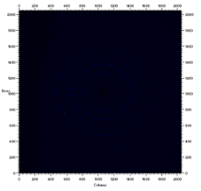

EVOLUC¸ AO˜ MICROESTRUTURAL DURANTE REVENIMENTO DO AC¸ O AISI H13 PRODUZIDO POR PBF-LB POR MEIO DE DIFRAC¸ AO˜ DE RAIOS X DE ALTA ENERGIA E DILATOMETRIA

Tabata Paola do Prado Rodrigues, FEM - Unicamp Dr. Eduardo Bertoni da Fonseca, FEM - Unicamp

Prof. Dr. Eder´ Socrates´ Najar Lopes, orientador, FEM - Unicamp

Tabata Paola do Prado Rodrigues

EVOLUC¸ AO˜ MICROESTRUTURAL DURANTE REVENIMENTO DO AC¸ O AISI H13 PRODUZIDO POR PBF-LB POR MEIO DE DIFRAC¸ AO˜ DE RAIOS X DE ALTA ENERGIA E DILATOMETRIA

Relatorio´ Final de Atividades do Programa Institucional de Bolsas de Iniciac¸ao˜ Cient´ıfica PIBIC/CNPq-Unicamp, com vigenciaˆ de Setembro de 2022 a Setembro de 2023 sob a orientac¸ao˜ do

Prof. Eder´ Socrates´ Najar Lopes.

2

Sumario´

[1 Introduc¸ ao˜](#_page4_x56.69_y56.69) 5 [2 Materiais e Metodos´ ](#_page5_x56.69_y56.69)6 [3 Resultados](#_page11_x56.69_y98.51) 12 [4 Discussao˜ e Conclusoes˜](#_page13_x56.69_y314.89) 14 [5 Bibliografia](#_page14_x56.69_y56.69) 15![ref1]

Lista de Figuras

1  [Difratograma do padrao˜ de LaB6](#_page5_x99.77_y740.30)

   [antes de um tratamento inicial da imagem.](#_page5_x99.77_y740.30) . . . . . . . . . . . . . . . . . . . . . . . . . . . . 6

2  [Difratograma do padrao˜ de LaB6](#_page5_x340.72_y740.30)

   [depois de um tratamento inicial da imagem.](#_page5_x340.72_y740.30) . . . . . . . . . . . . . . . . . . . . . . . . . . . 6

3  [Parametrosˆ utilizados como base na automatizac¸ao˜ do processo de construc¸ao˜ dos graficos´ de Intensidade versus 2θ. ](#_page6_x100.22_y357.91). . . . . . . . . . . . . . . . . . . . . . . . . . . . . . . . . . . . . . . 7
3  [Trecho do codigo´ de Ulla Vainio ](#_page7_x100.44_y441.74)[\[4\]](#_page14_x56.69_y205.16)[ onde os parametrosˆ escolhidos no arquivo .txt sao˜ iniciali- zadas no codigo´ ](#_page7_x100.44_y441.74). . . . . . . . . . . . . . . . . . . . . . . . . . . . . . . . . . . . . . . . . . 8
3  [Grafico´ de anguloˆ azimuthal versus 2θ](#_page8_x99.77_y243.41)

   [do padrao˜ de calibrac¸ao.˜ ](#_page8_x99.77_y243.41). . . . . . . . . . . . . . . . . . . . . . . . . . . . . . . . . . . . . 9

6  [Trecho da base de dados de um difratograma o qual demonstra o ´ınicio da variac¸ao˜ de intensi-](#_page8_x341.39_y243.41)

   [dade e o comec¸o de um pico (selec¸ao˜ em azul e´ o in´ıcio do pico). ](#_page8_x341.39_y243.41). . . . . . . . . . . . . . . . 9

7  [Trecho 1 do codigo´ para encontrar picos](#_page8_x99.77_y535.78)

   [e plotar Intensidade x Azimutal ](#_page8_x99.77_y535.78). . . . . . . . . . . . . . . . . . . . . . . . . . . . . . . . . . 9

8  [Trecho 2 do codigo´ para encontrar picos](#_page8_x340.72_y535.78)

   [e plotar Intensidade x Azimutal ](#_page8_x340.72_y535.78). . . . . . . . . . . . . . . . . . . . . . . . . . . . . . . . . . 9

9  [Trecho 1 do codigo´ para aplicar o Metodo´](#_page10_x99.77_y256.90)

   [de Williamson-Hall](#_page10_x99.77_y256.90) . . . . . . . . . . . . . . . . . . . . . . . . . . . . . . . . . . . . . . . . 11

10  [Trecho 2 do codigo´ para aplicar o Metodo´](#_page10_x346.17_y256.90)

    [de Williamson-Hall](#_page10_x346.17_y256.90) . . . . . . . . . . . . . . . . . . . . . . . . . . . . . . . . . . . . . . . . 11

11  [Trecho da base de dados utilizada para aplicac¸ao˜ do metodo´ de Williamson-Hall ](#_page10_x146.75_y615.25). . . . . . . . 11
11  [Graficos´ de Intensidade versus 2θ. para diferentes rotas de revenimento: a) 550 ºC; b) 575 ºC;](#_page11_x106.99_y711.07)

    [c) 600 ºC; d) 675 ºC ](#_page11_x106.99_y711.07). . . . . . . . . . . . . . . . . . . . . . . . . . . . . . . . . . . . . . . . 12

13  [Grafico´ de Intensidade x Azimutal](#_page12_x105.23_y529.19)

    [da fase Austenita no plano (1 1 1)](#_page12_x105.23_y529.19) . . . . . . . . . . . . . . . . . . . . . . . . . . . . . . . . 13

14  [Grafico´ de Intensidade x Azimutal](#_page12_x346.17_y529.19)

    [da fase Martensita no plano (2 0 0)](#_page12_x346.17_y529.19) . . . . . . . . . . . . . . . . . . . . . . . . . . . . . . . . 13

15  [Resultado do metodo´ Williamson-Hall](#_page13_x105.23_y256.91)

    [aplicado no difratograma 11 da Rota de reveni-](#_page13_x105.23_y256.91)

    [mento de 600ºC](#_page13_x105.23_y256.91) . . . . . . . . . . . . . . . . . . . . . . . . . . . . . . . . . . . . . . . . . . 14

16  [Resultado do metodo´ Williamson-Hall](#_page13_x346.17_y256.91)

    [aplicado no difratograma 165 da Rota de reveni-](#_page13_x346.17_y256.91)

    [mento de 600ºC](#_page13_x346.17_y256.91) . . . . . . . . . . . . . . . . . . . . . . . . . . . . . . . . . . . . . . . . . . 14![ref1]

1  Introduc¸ao˜

A manufatura aditiva (MA) e´ uma terminologia que reune diversas tecnologias revolucionarias´ baseadas na fabricac¸ao˜ de objetos tridimensionais a partir da adic¸ao˜ de camadas sucessivas de material. Nos ultimos´ anos, a MA tem se destacado como uma abordagem inovadora para a fabricac¸ao˜ de componentes complexos em diversas industrias.´ Entre as varias´ tecnicas´ que compoem˜ essa categoria, a fusao˜ em leito de po´ com feixe de laser (PBF-LB) tem se destacado como uma escolha proeminente no processamento de materiais metalicos.´ Essa tecnica´ revolucionaria´ permite a fabricac¸ao˜ camada-a-camada de pec¸as utilizando a energia altamente concentrada de um feixe de laser para fundir seletivamente um leito de po´ metalico,´ resultando em produtos com geometrias complexas e detalhes precisos.

Dentre as poss´ıveis aplicac¸oes˜ da tecnica´ de PBF-LB esta´ a fabricac¸ao˜ de moldes e matrizes para processos industriais, como forjamento, injec¸ao˜ e fundic¸ao.˜ A possibilidade de criar componentes com canais internos para refrigerac¸ao˜ tem demonstrado potencial para aumentar a vida util´ das ferramentas e a qualidade das pec¸as fabricadas. No entanto, o processamento pela tecnica´ de PBF-LB de ac¸os ferramenta tras´ diversos desafios cient´ıficos e tecnologicos´ relacionados a otimizac¸ao˜ do processo e a` evoluc¸ao˜ microestrutural dos materiais. O ac¸o AISI H13 e´ um dos principais materiais para fabricac¸ao˜ de ferramentas para trabalho a quente, por possuir elevada resistenciaˆ mecanicaˆ e ao desgaste mesmo quando submetido a temperaturas de operac¸ao˜ de ate´ 600°C.Essascaracter´ısticassao˜ conferidaspelamicroestruturamartens´ıticacomprecipitac¸ao˜ secundaria´ de carbonetos obtida por um tratamento termico´ de revenimento. Tipicamente, o ac¸o H13 passa por um tratamento termico´ queconsisteemaustenitizac¸ao˜ eresfriamentorapido´ (tempera)ˆ paraobtenc¸ao˜ daestruturamartens´ıtica, seguido de multiplos´ ciclos de revenimento em temperaturas entre 550 e 650 °C. Os ciclos de revenimento sao˜ determinados a partir do balanc¸o que se deseja obter entre resistenciaˆ mecanicaˆ e tenacidade, uma vez que a estrutura martens´ıtica obtida apos´ a temperaˆ possui elevada dureza, porem´ baixa tenacidade.

Ao contrario´ do processamento tradicional do ac¸o H13, o processo de PBF-LB resulta em uma microes- trutura complexa, que apresenta microssegregac¸ao˜ de elementos de liga e consequente estabilizac¸ao˜ de 20-25 %-vol. de austenita retida [\[1–3\].](#_page14_x56.69_y172.87) Esse fenomenoˆ impacta diretamente as propriedades mecanicas,ˆ como limite de resistenciaˆ e ductilidade, prejudicando a integridade das pec¸as fabricadas. Alem´ disso, a presenc¸a de elevada frac¸ao˜ de austenita retida pode comprometer a estabilidade das pec¸as, uma vez que essa fase metaestav´ el pode se transformar em martensita durante a operac¸ao˜ do componente, promovendo uma expansao˜ volumetrica.´ Por isso, e´ fundamental a aplicac¸ao˜ de tratamentos termicos´ apos´ o processo de PBF-LB para adequar a microes- trutura para as aplicac¸oes˜ t´ıpicas desse material. Tais tratamentos visam otimizar as propriedades do ac¸o H13 para operac¸oes˜ em alta temperatura.

Nesse projeto, foram estudadas rotas de revenimento direto da microestrutura como-fabricada do ac¸o H13 processado por PBF-LB. Para compreender o efeito de diferentes temperaturas de revenimento na evoluc¸ao˜ microestrutural do material, foram realizados experimentos in situ de difrac¸ao˜ de raios X durante a realizac¸ao˜ dos tratamentos termicos.´ Os experimentos foram realizados em uma fonte de luz s´ıncrotron de alta energia, a qual fornece elevada taxa de aquisic¸ao˜ de dados, permitindo acompanhar a evoluc¸ao˜ microestrutural ao longo do tempo a partir dos difratogramas coletados. No entanto, esse experimento resulta em uma coleta bastante extensa de dados, que necessita de tecnicas´ e ferramentas apropriadas para o processamento.

O objetivo principal desse projeto e´ de realizar um tratamento em larga escala em imagens bidimensionais obtidasemumaestac¸ao˜ experimentaldedifrac¸ao˜ deraiosXdepolicristais, explorandosequenciasˆ deoperac¸oes˜ que transformem essas imagens em dados numericos´ analisav´ eis. A metodologia desenvolvida nesse projeto possibilita uma avaliac¸ao˜ detalhada da evoluc¸ao˜ microestrutural durante o revenimento direto de pec¸as produ- zidas por PBF-LB e pode ser facilmente adaptada para outros materiais avaliados em estac¸oes˜ experimentais similares.

O resultado desse estudo nao˜ apenas preenche uma lacuna no entendimento dos efeitos do tratamento termico´ em pec¸as produzidas por PBF-LB, mas tambem´ abre portas para correlac¸oes˜ significativas entre os dados obtidos e as mudanc¸as observadas na microestrutura. Adicionalmente, essa pesquisa serve como um incentivo para explorar e aprimorar as intersec¸oes˜ entre cienciaˆ e engenharia dos materiais, aprofundando os fundamentos e as tecnicas´ envolvidas, alem´ de buscar formas inovadoras de dinamizar o processamento de dados, contribuindo assim para o avanc¸o cont´ınuo da MA e suas aplicac¸oes˜ praticas.´![ref1]

2  Materiais e Metodos´

Apos´ revisao˜ da teoria de difrac¸ao˜ de raios X em materiais policristalinos, buscou-se ferramentas computa- cionaisquepermitissemoprocessamentodedadosemloteequeseadequassemmelhoraoobjetivodapesquisa. O software Fit2D, para processamento dos dados bidimensionais e´ uma ferramenta ja´ muito utilizada no ramo da cristalografia, com recursos para calibrac¸ao˜ e correc¸ao˜ de distorc¸oes˜ do detector, integrac¸ao˜ azimutal e di- versas ferramentas de analise.´ Alem´ disso, e´ um software com boa usabilidade e gratuito, por isso foi escolhido paraotratamentodedadosdesseprojeto. Outras ferramentasmuito utilizadasforam os notebooksPython, alem´ de suas proprias´ bibliotecas que ofereceram muitos recursos para otimizac¸ao˜ das leituras necessarias.´ Com es- ses intrumentos definidos, o metodo´ tornou-se o foco do projeto. Foi necessaria´ a segmentac¸ao˜ dos processos de analise,´ de forma que diferentes codigos´ pudessem atender as` demandas e fornecer resultados intermediarios´ em relac¸ao˜ a` conjecturas finais.

Os dados processados nesse projeto sao˜ imagens adquiridas com um detector bidimensional[ 1,](#_page5_x99.77_y740.30) contendo aneis´ de difrac¸ao˜ de raios-X em experimentos realizados em fonte de luz s´ıncrotron (DESY P07) de alta energia (87,1 keV) em modo de transmissao˜ com frequenciaˆ de ate´ 1 Hz. Essa e´ uma tecnica´ de analise´ estrutural que permite investigar a estrutura cristalina de materiais em uma escala atomica.ˆ No modo de transmissao,˜ os raios X atravessam a amostra, e as mudanc¸as na direc¸ao˜ desses raios causadas pelos cristais revelam informac¸oes˜ sobre a estrutura cristalina do material. Alem´ da obtenc¸ao˜ de padroes˜ de difrac¸ao˜ de alta energia, o ensaio tambem´ envolveu a obtenc¸ao˜ de dados simultaneosˆ de dilatometria que e´ uma tecnica´ de medic¸ao˜ que permite acompanhar a variac¸ao˜ dimensional de um material em func¸ao˜ da temperatura. Isso e´ particularmente util´ para entender as transformac¸oes˜ de fase que ocorrem durante o aquecimento ou resfriamento.

De in´ıcio, a integrac¸ao˜ azimutal dos aneis´ de difrac¸ao˜ foi feita de forma individual para familiarizac¸ao˜ com o software Fit2D[ 2.](#_page5_x340.72_y740.30) Essa forma tambem´ permitiu a execuc¸ao˜ de testes para obtenc¸ao˜ de parametrosˆ de calibrac¸ao,˜ os quais posteriormente foram fixados para garantir que todos os difratogramas fossem gerados a partir da mesma calibrac¸ao˜ de forma automatizada [\[4\].](#_page14_x56.69_y205.16) A integrac¸ao˜ azimutal permite a transformac¸ao˜ dos aneis´ de difrac¸ao˜ em difratogramas tradicionais no formato Intensidade versus 2θ, o que e´ feito para cada imagem que foi obtida na estac¸ao˜ experimental. Cerca de 1300 imagens foram coletadas para cada rota de revenimento. Ao todo, quatro rotas de revenimento foram avaliadas: 550, 575, 600 e 650 graus Celsius por 1 h. Dessa forma, como tal processo feito imagem por imagem dispenderia muito tempo, esse foi o primeiro processo automatizado. Para isso ser poss´ıvel, antes da implementac¸ao˜ do script foi realizada a calibrac¸ao˜ a partir de um composto padrao,˜ no caso LaB6. Tambem´ foi feito o entendimento do passo a passo para o tratamento da imagem, o que facilitaria encontrar os aneis´ de difrac¸ao˜ como mostrado nas figuras, e foram investigados os valores de parametroˆ alem´ de feita obtenc¸ao˜ dos resultados iniciais para compara-los´ com os posteriores, realizados pelo codigo.´ Apos´ alguns testes e utilizando valores experimentais como base, obteve-se

- parametrosˆ de calibrac¸ao,˜ por exemplo, a distanciaˆ entre a amostra e o detector e a posic¸ao˜ do centro do feixe no detector. Apos´ a obtenc¸ao˜ do arquivo de calibrac¸ao,˜ estabeleceu-se um codigo´ que pudesse fazer a sequenciaˆ de passos da integrac¸ao˜ azimutal de forma automatizada.

XXXI Congresso de Iniciac¸ao˜ Cient´ıfica da UNICAMP - 2023 7

Figura 1: Difratograma do padrao˜ de LaB6antes de um tratamento inicial da imagem.![ref1]



Figura 2: Difratograma do padrao˜ de LaB6 depois de um tratamento inicial da imagem.

XXXI Congresso de Iniciac¸ao˜ Cient´ıfica da UNICAMP - 2023 8

Assim, a primeira etapa do processamento de dados foi automatizada utilizando um script em Python que automaticamente inicia o Fit2D [\[4\],](#_page14_x56.69_y205.16) seta os parametrosˆ de entrada atraves´ de um arquivo em formato .txt, figura [3,](#_page6_x100.22_y357.91) seleciona as imagens de difrac¸ao˜ a partir de um diretorio,´ gera e salva os graficos´ de Intensidade versus 2θ para cada imagem. A partir desses difratogramas, e´ poss´ıvel avaliar os parametrosˆ de rede das fases, a largura dos picos a meia altura e a frac¸ao˜ volumetrica´ de fases do ac¸o.

Outras ferramentas de processamento do Fit2D permitiram a obtenc¸ao˜ de outros graficos´ de interesse uti- lizando o mesmo script, alterando apenas alguns valores no arquivo .txt com os parametrosˆ de entrada, figura [3.](#_page6_x100.22_y357.91) Da mesma forma, e´ poss´ıvel analisar de uma unica´ vez todas as imagens de um dado experimento a par- tir de um diretorio´ selecionado. Tais mudanc¸as no arquivo de texto temˆ relac¸ao,˜ principalmente, com como as configurac¸oes˜ do proprio´ software quando combinadas de diferentes maneiras, induzem a construc¸ao˜ de graficos´ distintos. Apos´ definir a primeira imagem como input, sendo essa do composto ja´ conhecido para calibrac¸ao,˜ nesse caso o LaB6, o passo seguinte consiste em definir a area´ de interesse do difratograma. Apos´ confirmada a area,´ telas com quantidades numericas´ para cada parametroˆ aparecem, onde e´ controlav´ el o tipo de grafico´ a ser gerado.

Figura 3: Parametrosˆ utilizados como base na automatizac¸ao˜ do processo de construc¸ao˜ dos graficos´ de Inten- sidade versus 2θ.

Como exemplo, quando o objetivo e´ plotar um grafico´ de Intensidade versus 2θ, o Number of azimuthal Bins e´ setado como 1, ja´ o Number of radial/2θ Bins e´ setado como 360. Para se conseguir isso no Fit2D por meio do script Python, figura[ 4,](#_page7_x100.44_y441.74) altera-se o arquivo .txt, figura[ 3,](#_page6_x100.22_y357.91) sendo que a linha abaixo da nomeada como CAKE Bins in radial direction refere-se, nesse caso ao parametroˆ que sera´ setado como 360 e, por conseguinte, a linha abaixo do CAKE Azimuthal binssera´ a setada como 1. Alem´ desse, outro grafico´ possivel de se plotar e´ o de Intensidade versus Azimutal. Nesse caso, basta trocar os valores antes citados, ou seja, o Number of azimuthal Bins e´ 360 e Number of radial/2θ Bins e´ 1. Por fim, outro grafico´ utlizado nesse projeto e´ o de Azimutal versus 2θ, e para esse, alem´ dos dois parametrosˆ principais citados anteriormente, outros importantes sao˜ o CAKE Inner radius, a partir de onde comec¸ara´ a ser considerado os aneis´ e o CAKE Outer radius, finalde onde importa na imagem para o grafico´ pretendido. Nesse caso, esses valores e o Number of radial/2θ Binssao˜ determinados por testes manuais, visto que os primeiros aneis´ do difratograma podem ser descartados quando se tratam de difrac¸ao˜ de segunda ordem. Para as imagens tratadas nesse projeto, utilizou-se 220 (pixeis) para o anguloˆ de in´ıcio da imagem, 660 para o anguloˆ de fime, portanto, 440 para o numero´ de divisoes˜ radiais.

Cada parametroˆ da figura[4 ](#_page7_x100.44_y441.74)esta´ associado a uma linha espec´ıficano arquivo .txt. Por exemplo, o parametroˆ na posic¸ao˜ 1 (indexado a partir de 0) no arquivo esta´ relacionado a` linha 1 do arquivo, o parametroˆ na posic¸ao˜ 3 esta´ relacionado a` linha 3 e assim por diante. Cada linha do arquivo contem´ um valor que e´ extra´ıdo e atribu´ıdo a uma variav´ el correspondente. Os nomes das variav´ eis sao˜ os mesmos nomes ou muito parecidos aos que estao˜ no Fit 2D e os valores extra´ıdos do arquivo de texto sao˜ convertidos para tipos de dados apropriados usando as func¸oes˜ float()e int(). Isso e´ necessario´ para que esses valores possam ser usados em calculos´ matematicos´ ou comparac¸oes˜ mais tarde.

Os parametrosˆ nas posic¸oes˜ 13 e 15 temˆ caracter´ısticas espec´ıficas. Ao inves´ de terem como atribuic¸ao˜ um numero´ inteiro ou float, estao˜ relacionados a` configurac¸ao˜ de uma mascara,´ ou seja, uma area´ que nao˜ e´ rele- vante para a analise´ ou que precisa ser desconsiderada, e a` subtrac¸ao˜ de corrente escura, uma corrente eletrica´ que flui atraves´ dos pixels do sensor mesmo na ausenciaˆ de luz ou radiac¸ao˜ incidente e pode afetar as imagens. O codigo´ verifica se as primeiras duas letras do valor na posic¸ao˜ 13 sao˜ NO ou nao.˜ Se for NO, ele define certas variav´ eis e imprime mensagens relevantes. Caso contrario,´ ele considera o valor como um nome de arquivo e faz o mesmo para a posic¸ao˜ 15. O codigo´ imprime mensagens no console dependendo das condic¸oes˜![ref1] verificadas. Ele imprime se uma mascara´ esta´ sendo usada, qual e´ o arquivo da mascara,´ se a subtrac¸ao˜ de corrente escura esta´ sendo aplicada e qual e´ o arquivo de corrente escura. Os valores nas ultimas´ posic¸oes˜ (17 em diante) sao˜ atribu´ıdos a outras variav´ eis que estao˜ relacionadas a parametrosˆ do detector e da geometria da configurac¸ao˜ experimental. No geral, este trecho de codigo´ esta´ organizando e interpretando os parametrosˆ contidos no arquivo de texto, convertendo-os em tipos de dados apropriados e configurandovariav´ eis que serao˜ usadas na analise´ e processamento de dados.

Figura 4: Trecho do codigo´ de Ulla Vainio [\[4\]](#_page14_x56.69_y205.16) onde os parametrosˆ escolhidos no arquivo .txt sao˜ inicializadas no codigo´

Esse codigo´ posteriormente, cria um arquivo de macro que e´ responsav´ el por construir um conjunto de comandos que sao˜ lidos e executados pelo software Fit2d. Esses comandos configuram detalhes sobre como os dados de difrac¸ao˜ devem ser processados. O codigo´ escreve esses comandos em um arquivo chamado ”fit2d.mac”. Os comandos abrangem configurac¸oes˜ gerais, detalhes do processamento, condic¸oes˜ de controle e ac¸oes˜ de sa´ıda. Apos´ a criac¸ao˜ do arquivo de macro, o codigo´ executa o Fit2d com base nesse arquivo para automatizar o processamento dos dados de difrac¸ao.˜ Em resumo, a criac¸ao˜ do arquivo de macro personaliza as configurac¸oes˜ e comandos para o Fit2d, permitindo que ele processe os dados de maneira automatizada e de acordo com as especificac¸oes˜ fornecidas nos parametros.ˆ

Com os graficos´ de Azimutal versus 2θ, figura[5,](#_page8_x99.77_y243.41) o foco posterior foi a analise´ em func¸ao˜ do eixo azimutal pensada com o intuito de observar a orientac¸ao˜ preferencial, comparando intensidades relativas dos picos com intensidades teoricas´ e a distribuic¸ao˜ desses no eixo azimutal. Todo material policristalino e´ composto por graos˜ individuais, ou seja, cristais com uma estrutura ordenada. A maneira como esses graos˜ se organizam pode resultaremumadistribuic¸ao˜ nao˜ aleatoria´ desuasorientac¸oes˜ cristalograficas,´ ouseja, certasdirec¸oes˜ ouplanos cristalograficos´ sao˜ mais frequentemente orientados em uma determinada direc¸ao.˜ Orientac¸oes˜ preferenciais afetam as propriedades eletricas,´ magneticas´ e mecanicasˆ do material [\[5\],](#_page14_x56.69_y223.31) disso se da´ a importanciaˆ de se analisar tal parametro.ˆ![ref1]

 

Figura 5: Grafico´ de anguloˆ azimuthal versus 2θ Figura 6: Trecho da base de dados de um difratograma do padrao˜ de calibrac¸ao.˜ o qual demonstra o ´ınicio da variac¸ao˜ de intensidade e o comec¸o de um pico (selec¸ao˜ em azul e´ o in´ıcio do pico).

Os dados retirados pelo grafico´ foram colocados em formato de tabela, com cada linha sendo uma das 360 sec¸oes˜ (1 sec¸ao˜ = 1 grau) dos aneis´ (eixo azimutal) e cada coluna sendo uma das divisoes˜ do valor de 2θ. Com a tabela extra´ıda, figura[ 6,](#_page8_x341.39_y243.41) a determinac¸ao˜ dos picos para um valor 2θ fixo foi feita atraves´ da biblioteca scipy do Python, onde os picos seriam os maiores valores em colunas sequenciais somadas da tabela. A partir disso, foi extra´ıdo um grafico´ de Intensidade versus Azimutal para cada pico encontrado e definido sua fase e plano cristalografico.´

XXXI Congresso de Iniciac¸ao˜ Cient´ıfica da UNICAMP - 2023 10

Figura 7: Trecho 1 do codigo´ para encontrar picose plotar Intensidade x Azimutal



Figura 8: Trecho 2 do codigo´ para encontrar picos e plotar Intensidade x Azimutal

XXXI Congresso de Iniciac¸ao˜ Cient´ıfica da UNICAMP - 2023 

O primeiro trecho do codigo,´ figura[ 7,](#_page8_x99.77_y535.78) converte o DataFrame, que e´ o arquivo que foi tirado do Fit2D, em formato de tabela para os graficos´ de Azimutal versus 2θ, em uma matriz numpy. A partir disso, data contem´ os dados do arquivo em um formato que o codigo´ podera´ trabalhar. Posteriormente, o codigo´ comec¸a a encontrar os picos do difratograma que foi transformado no arquivo data. Primeiro, inicializa uma lista vazia em que os´ındices das colunas no Microsoft Excelque correspondem aos picos encontrados serao˜ armazenados. Ademais, um loop ’for’ itera atraves´ das linhas da matriz data, sendo cada linha um anguloˆ azimutal diferente. Dentro desse loop ’for’, e´ extra´ıda a linha atual da matriz como o padrao˜ de difrac¸ao˜ para um anguloˆ azimutal espec´ıfico. A variav´ el declarada como thereshold defineum limiar de altura para encontrar os picos, nesse caso, apos´ algumas analises´ manuais, o valor escolhido foi de 1.5e+07, referente a` intensidade. Finalmente, a func¸ao˜ ’findpeaks’e´ usadaparaencontraros´ındicesdospicosnopadrao˜ dedifrac¸ao˜ combasenolimiardefinido. Epor ultimo´ dentro do primeiro loop, os ´ındices encontrados sao˜ adicionados a` lista peaks. Como comparativamente a outros difratogramas ja´ integrados e estudados anteriormente, a ordem em que os picos aparecem remetem por si so´ aos planos e as fases daquele pico, dessa forma, os graficos´ plotados de Intensidade versus Azimutal temˆ os t´ıtulos atribu´ıdos, por exemplo, o primeiro pico e´ de Austenita, seu plano e´ (1 1 1), entao˜ o t´ıtulo do grafico´ 1 contem´ exatamente essas duas informac¸oes.˜ Ao todo, para esses experimentos, observa-se geralmente![ref1] 6 picos diferentes e as vezes um setimo,´ esse nao˜ e´ tao˜ interessante, portanto quando aparecer, sera´ chamado apenas de ”Pico Residual”. No segundo trecho do codigo,´ figura[ 8,](#_page8_x340.72_y535.78) tem-se o segundo loop ’for’, que, por sua vez, itera atraves´ dos ´ındices dos picos encontrados no primeiro anguloˆ azimutal, ou seja, o primeiro valor dentro da lista ’peaks’, verificase o ´ındice do pico esta´ dentro dos limites permitidos e, em seguida, itera pelas colunas adjacentes, ou seja, pelos angulosˆ 2θ posteriores e anteriores, para calcular uma media´ entre os valores de intensidade de pico para aquele Azimutal. Dessa forma, os graficos´ sao˜ criados em cima do valor medio,´

- que e´ interessante pois assim e´ poss´ıvel considerar os desvios de cada pico. A ultima´ parte do codigo´ , diz respeito apenas a` plotagem. E´ ali que as definic¸oes˜ relacionadas ao grafico´ gerado serao˜ configuradas.

  A partir dos graficos´ de Intensidade versus 2θ, e´ poss´ıvel encontrar informac¸oes˜ que sao˜ essenciais para analises´ cristalograficas.´ Primeiramente, o FWHM ou Full Width at Half Maximume´ uma medida da largura de um pico de difrac¸ao˜ em um espectro. Ele representa a largura angular na metade da altura maxima´ do pico, ou seja, e´ a largura angular ou espacial medida na metade da intensidade do pico. O FWHM tambem´ e´ um indicador da resoluc¸ao˜ do instrumento utilizado para a analise,´ picos mais estreitos (menor FWHM) indicam uma melhor resoluc¸ao˜ e a capacidade de distinguir pequenas variac¸oes˜ nas posic¸oes˜ dos picos. Uma vez que os experimentos foram realizados em uma mesma configurac¸ao˜ experimental, o FWHM pode ser relacionado com a densidade de defeitos cristalinos no material. O 2θ, e´ o anguloˆ de difrac¸ao˜ dos raios X e e´ medido entre o raio incidente e o raio difratado. As posic¸oes˜ angulares dos picos de difrac¸ao˜ estao˜ relacionadas com as distanciasˆ interatomicasˆ na estrutura cristalina. Sua analise,´ portanto, permite determinar as distanciasˆ interatomicasˆ na rede cristalina. Por fim, a area´ do pico de difrac¸ao˜ e´ uma medida da quantidade total de intensidade difratada paracadapicoee´ proporcionala` quantidadedomaterialquecontribuiparaadifrac¸ao˜ naqueleangulo.ˆ Portanto, a area´ dos picos e´ usada para quantificar a frac¸ao˜ das fases cristalinas em uma amostra. Todos esses valores sao˜ pass´ıveis de analise´ nos graficos´ de Intensidade versus 2θ e foram a base para a utilizac¸ao˜ do metodo´ de

  Williamson-Hall. O tratamento dos dados de FWHM, Anguloˆ 2θ e Area´ foram objeto de outro projeto, dadas

  as caracter´ısticas espec´ıficasda aquisic¸ao˜ dos dados em diferentes materiais. Os dados sao˜ exportados na forma de uma tabela, que foi utilizada como arquivo de entrada nesse projeto.

Assim, com os dados de FWHM, Anguloˆ 2θ e Area´ dos picos ja´ tabelados, apenas a separac¸ao˜ em duas

planilhas foi feita dentro do proprio´ Microsoft Excel, uma para aos picos de Austenita e outra para os picos de Martensita, o que facilitou fazer o tratamento espec´ıfico para cada fase. Entao,˜ o metodo´ Williamson-Hall, que e´ uma abordagem grafica´ para analisar os picos de difrac¸ao˜ de materiais policristalinos, foi aplicado. O metodo´ consiste em determinar o tamanho de cristalito e a microdeformac¸ao˜ para cada fase em um difratograma baseado no FWHM e no anguloˆ de difrac¸ao˜ 2θ. Para isso, e´ realizada uma regressao˜ linear a partir das variav´ eis apresentadas na equac¸ao˜ a seguir:

Kλ

β cosθ = ϵsin θ + equac¸ao˜ original (1)

L

Na equac¸ao˜ [1,](#_page9_x525.86_y511.60) o termo a` esquerda da igualdade esta´ relacionado a` largura do pico a` meia-altura β, o primeiro termo a` direita da igualdade esta´ relacionado a` microdeformac¸ao˜ ϵ da rede cristalina e o segundo termo a direita e´ a contribuic¸ao˜ do tamanho do cristalito L. As demais variav´ eis sao:˜

- θ e´ o anguloˆ de difrac¸ao,˜
- K e´ uma constante relacionada ao espalhamento dos raios X (depende do comprimento de onda da radiac¸ao,˜ tipo de cristalito, etc.),
- λ e´ o comprimento de onda dos raios X utilizados na difrac¸ao,˜

Kλ

β cosθ = y = bx + a = ϵsin θ + (~~ ) equac¸ao˜ com parametrosˆ ’a’ e ’b’ para ajuste de reta (2)

L

A equac¸ao˜ [2 ](#_page9_x525.86_y696.23)demonstra como o ajuste da curva foi feito em func¸ao˜ de θ, sendo que ’b’ relaciona-se com ϵsin θ, ou seja, com a microdeformac¸ao˜ e, por sua vez, ’a’ esta´ ligado ao tamanho do cristalito L.![ref1]

 

Figura 9: Trecho 1 do codigo´ para aplicar o Metodo´ Figura 10: Trecho 2 do codigo´ para aplicar o Metodo´ de Williamson-Hall de Williamson-Hall

O codigo´ comec¸a carregando o arquivo Excel que e´ lido em um DataFrame Pandas chamado ’df’, figura [9.](#_page10_x99.77_y256.90) A func¸ao˜ pd.read excel e´ usada para ler os dados da planilha chamada ’Sheet1’ e pular a primeira linha (skiprows=[0]) que contem´ cabec¸alhos de coluna. O codigo´ entao˜ cria um diretorio´ chamado ’Plots W-H’ para salvar os graficos´ resultantes, caso ele nao˜ exista. Isso e´ feito usando a func¸ao˜ os.makedirs. Como na tabela podem existir valores que nao˜ foram calculados, para que a leitura dela como uma matriz nao˜ seja prejudicada, qualquer valor ausente (NaN) no DataFrame e´ preenchido com zero usando a func¸ao˜ df.fillna(0,inplace=True). Apos´ essas adaptac¸oes˜ iniciais, e´ definida uma func¸ao˜ chamada instrumental broadening, que calcula a largura do pico instrumental com base no anguloˆ de difrac¸ao˜ (em radianos) e na largura a meia altura (FWHM) do pico. A largura de um pico instrumental, em contexto anal´ıtico, refere-se a` medida da dispersao˜ dos sinais ou picos obtidos em uma analise´ instrumental e basicamente fornece informac¸oes˜ sobre o quao˜ bem definido ou estreito e´ um pico em um grafico´ de dados, o que tem influenciaˆ das definic¸oes˜ do instrumento f´ısico de analise´ utilizado.

Figura 11: Trecho da base de dados utilizada para aplicac¸ao˜ do metodo´ de Williamson-Hall

Posteriormente, um loop e´ utilizado para iterar por cada linha de ’df’, sendo que uma linha tem os dados de FWHM, 2θ e Area´ para cada pico do grafico´ de Intensidade versus 2θ, figura[ 11.](#_page10_x146.75_y615.25) Os angulosˆ de difrac¸ao˜

em graus sao˜ convertidos em radianos dividindo por 2 (pois os dados estao˜ em 2θ) e a partir dessa alterac¸ao˜ a largura de pico instrumental e´ calculada usando a func¸ao˜ instrumental broadening para as FWHM convertidas em radianos e os angulosˆ em radianos. Os dados calculados sao˜ usados para gerar um grafico´ de dispersao,˜ figura[ 10,](#_page10_x346.17_y256.90) o seno dos angulosˆ e´ plotado no eixo x, e a largura de pico instrumental multiplicada pelo cosseno dos angulosˆ e´ plotada no eixo y. Em seguida, e´ feito um ajuste linear aos dados usando a func¸ao˜ curve fit. Com isso, sao˜ obtidos os parametrosˆ ’a’ e ’b’ na equac¸ao˜ da reta a \* x + b, onde ’a’ e ’b’ sao˜ usados para calcular

- tamanho medio´ do cristalito e a microdeformac¸ao.˜ Todos os parametrosˆ calculados, ’a’, ’b’, referentes a` equac¸ao˜ [2,](#_page9_x525.86_y696.23) ’size’ que refere-se ao tamanho medio´ do cristalito e ’strain’ que e´ a microdeformac¸ao,˜ sao˜ anotados![ref1] nos graficos´ que sao˜ salvos no diretorio´ ’Plots W-H’ com um nome unico´ com base no ´ındice da linha dentro de ’df’.
3  Resultados

No contexto da analise´ da integrac¸ao˜ azimutal dos aneis´ de difrac¸ao,˜ examina-se os graficos´ de Intensi- dade versus 2θ na figura[ 12.](#_page11_x106.99_y711.07) Esses graficos´ representam os difratogramas obtidos apos´ a integrac¸ao˜ azimutal usando um script em Python da figura[ 4,](#_page7_x100.44_y441.74) [\[4\],](#_page14_x56.69_y205.16) e permitem comparar os resultados de quatro diferentes rotas de revenimento. Ao analisar esses graficos,´ observa-se que o aumento da temperatura resulta em um aumento na intensidade dos picos de martensita/ferrita, o que e´ mais pronunciado no pico de maior magnitude. Ao mesmo tempo, os picos de austenita, de menor intensidade, tornam-se ainda menos evidentes apos´ os tratamentos termicos.´

Esses padroes˜ fornecem informac¸oes˜ importantes sobre como as diferentes condic¸oes˜ de revenimento afe- tam a estrutura cristalina do material em estudo. A variac¸ao˜ na intensidade dos picos e a sua evoluc¸ao˜ com a temperatura podem ser indicativos de transformac¸oes˜ de fases, evoluc¸ao˜ de tamanho de grao˜ ou tensoes˜ in- ternas no material. Portanto, esses graficos´ sao˜ ferramentas cruciais para compreender e otimizar o processo de revenimento, bem como para investigar e evidenciar propriedades estruturais e termicas´ em detrimento de outras nao˜ interessantes para a func¸ao˜ almejada no ac¸o ferramenta. Nesse projeto, os graficos´ integrados nao˜ foram objeto de estudos aprofundados, ja´ que essas atividades compuseram outro projeto de pesquisa.

Figura 12: Graficos´ de Intensidade versus 2θ. para diferentes rotas de revenimento: a) 550 ºC; b) 575 ºC; c) 600 ºC; d) 675 ºC

Outra informac¸ao˜ derivada dos difratogramas, e que foi alvo de investigac¸ao˜ nesse projeto, diz respeito aos graficos´ Azimutal versus 2θ, conforme ilustrado na figura[ 5.](#_page8_x99.77_y243.41) Ao processar esses dados e inseri-los em uma![ref1] planilha, e´ poss´ıvel construir uma base de dados para cada difratograma. Esses dados essencialmente delineiam a presenc¸a ou ausenciaˆ de picos difratados. Isso pode ser claramente exemplificadona figura[6,](#_page8_x341.39_y243.41) onde cada linha representa uma divisao˜ radial dos 360 graus, cada coluna corresponde a uma subdivisao˜ de 1 grau de variac¸ao˜ no anguloˆ 2θ e area´ selecionada em azul mostra o in´ıcio de um pico.

Atraves´ de graficos´ desse tipo, figura[ 5 ](#_page8_x99.77_y243.41)e da subsequente base de dados, podem-se obter informac¸oes˜ de grande inportancida.ˆ Essas permitem identificac¸ao˜ das posic¸oes˜ exatas dos picos de difrac¸ao,˜ o que e´ funda- mental para determinar a estrutura cristalina do material. Alem´ disso, a presenc¸a ou ausenciaˆ de picos em diferentes angulosˆ de 2θ pode indicar a presenc¸a de fases cristalinas espec´ıficas. Essa analise´ detalhada das informac¸oes˜ azimutais e dos angulosˆ de difrac¸ao˜ e´ essencial para entender a composic¸ao˜ e a estrutura cristalina do material, atraves´ do mapeamento preciso dos picos difratados.

Ao utilizar a tabela derivada do grafico´ de Azimutal versus 2θ, figura[6,](#_page8_x341.39_y243.41) e´ poss´ıvel criar graficos´ de intensi- dade em func¸ao˜ do anguloˆ azimutal quando o valor do segundo parametroˆ e´ mantido fixo,figuras[13 ](#_page12_x105.23_y529.19)e[ 14.](#_page12_x346.17_y529.19) Esse procedimento foi realizado para os picos identificados, aproximadamente 7 em cada difratograma. Atraves´ desses graficos,´ pode-se realizar analises´ adicionais de algumas propriedades f´ısicas do ac¸o AISI H13.

Esses graficos´ oferecem uma visao˜ mais aprofundada das caracter´ısticas dos picos de difrac¸ao.˜ Eles per- mitem investigar a distribuic¸ao˜ de intensidade ao redor de cada pico, o que pode fornecer informac¸oes˜ sobre a orientac¸ao˜ e a textura cristalina do material. Alem´ disso, a variac¸ao˜ da intensidade com o anguloˆ azimutal pode revelar dados importantes sobre a anisotropia do material, bem como a presenc¸a de tensoes˜ residuais ou desordens estruturais, contribuindo para uma compreensao˜ mais completa e precisa das caracter´ısticas do ac¸o H13.

XXXI Congresso de Iniciac¸ao˜ Cient´ıfica da UNICAMP - 2023 15

Figura 13: Grafico´ de Intensidade x Azimutalda fase Austenita no plano (1 1 1)



Figura 14: Grafico´ de Intensidade x Azimutal da fase Martensita no plano (2 0 0)

XXXI Congresso de Iniciac¸ao˜ Cient´ıfica da UNICAMP - 2023 

No contexto do metodo´ de Williamson-Hall, empregado para analisar os picos identificadosde martensita e austenita, obteve-se informac¸oes˜ sobre o tamanho dos cristalitos em nanometrosˆ e sua microdeformac¸ao.˜ Esses dados sao˜ representados nas legendas dos graficos´ das figuras[ 15 ](#_page13_x105.23_y256.91)e[ 16.](#_page13_x346.17_y256.91) Importante ressaltar que essa analise´ pode ser conduzida de forma sistematica´ tambem,´ ou seja, aplicada sequencialmente a diversos picos, devido ao codigo´ das figuras[7 ](#_page8_x99.77_y535.78)e[ 8 ](#_page8_x340.72_y535.78)desenvolvido com essa finalidade.

Esses graficos´ de tamanho de cristalito e microdeformac¸ao˜ temˆ tambem´ uma importanciaˆ substancial na caracterizac¸ao˜ dos materiais. Atraves´ deles, pode-se avaliar a estrutura cristalina do material em uma escala na- nometrica´ eentendercomoelae´ afetadaporprocessostermicos´ oumecanicos.ˆ Essaanalise´ temsuaimportanciaˆ para, por exemplo, monitorar mudanc¸as no tamanho dos cristalitos ao longo do tempo em tratamentos termicos´ ou durante processos de fabricac¸ao.˜ Com isso, essa ferramenta pode ser utilizada para ajustar as condic¸oes˜ de tratamento termico´ e otimizar propriedades, como resistenciaˆ mecanicaˆ e ductilidade, compreender como as microdeformac¸oes˜ afetam o comportamento mecanicoˆ do material e sua capacidade de resistir a esforc¸os externos, alem´ de ser poss´ıvel a investigac¸ao˜ da relac¸ao˜ entre a microestrutura e o desempenho do material, fornecendo a base para o desenvolvimento de novos materiais com propriedades espec´ıficas.![ref1]

 

Figura 15: Resultado do metodo´ Williamson-Hall Figura 16: Resultado do metodo´ Williamson-Hall aplicado no difratograma 11 da Rota de reveni- aplicado no difratograma 165 da Rota de reveni- mento de 600ºC mento de 600ºC

4  Discussao˜ e Conclusoes˜

Em s´ıntese, este estudo apresentou uma metodologia robusta para analisar dados de difrac¸ao˜ de raios-X de alta energia coletados no modo transmissao,˜ aplicando-a a` investigac¸ao˜ da evoluc¸ao˜ microestrutural durante o processo de revenimento do ac¸o AISI H13 produzido por fusao˜ em leito de po´ com feixe de laser (PBF-LB). A analise´ minuciosa dos difratogramas ao longo dos tratamentos de revenimento revelou transformac¸oes˜ de fase em estado solido,´ enquanto a integrac¸ao˜ azimutal dos aneis´ de difrac¸ao˜ e a analise´ em func¸ao˜ do eixo azimutal permitirao˜ a avaliac¸ao˜ de orientac¸oes˜ preferenciais, determinac¸ao˜ de parametrosˆ de rede, largura de pico a` meia-altura e frac¸ao˜ volumetrica´ de fases. Embora tenha-se enfrentado alguns desafios no processo, a aplicac¸ao˜ do metodo´ de Williamson-Hall proporcionou informac¸oes˜ cruciais sobre o tamanho dos cristalitos e a microdeformac¸ao˜ em cada etapa do tratamento termico.´

Estes resultados enriqueceram significativamente o entendimento da microestrutura do ac¸o AISI H13 pro- duzidoporPBF-LBeosefeitosdotratamentotermico.´ Essasinformac¸oes˜ desempenhamumpapelfundamental no aprimoramento das etapas de processamento e pos-processamento´ na manufatura aditiva, bem como na ga-

rantia da seguranc¸a do material em suas aplicac¸oes˜ primarias.´ A` medida que segue-se adiante, futuros estudos temˆ o potencial de aprofundar ainda mais essa investigac¸ao˜ e buscar otimizac¸oes,˜ contribuindo para avanc¸os no

uso aprimorado desse material. Assim, este trabalho nao˜ apenas expande nosso conhecimento cient´ıfico, mas tambem´ promove a utilizac¸ao˜ eficiente e versatil´ do ac¸o AISI H13 produzido por PBF-LB, impulsionando a inovac¸ao˜ e a excelenciaˆ em diversas aplicac¸oes.˜![ref1]

5  BibliografiaReferenciasˆ
1. Krell, J.; Rottger¨ , A.; Geenen, K.; Theisen, W. Journal of Materials Processing Technology 2018, 255, 679–688.
1. Deirmina, F.; Peghini, N.; AlMangour, B.; Grzesiak, D.; Pellizzari, M. Materials Science and Engineering: A2019, 753, 109–121.
1. Fonseca, E. B.; Gabriel, A. H.; Araujo,´ L. C.; Santos, P. L.; Campo, K. N.; Lopes, E. S. Additive Manufac- turing 2020, 34, 101250.
1. Vainio, U. GitHub repository,[ https://github.com/uvainio/chiplotter/tree/master.](https://github.com/uvainio/chiplotter/tree/master)
1. Cullity, B. D., Elements of X-ray Diffraction; Addison-Wesley Publishing: 1956.
1. Areias, H. P. Analise´ de Dados de Amostras Metalicas´ atraves´ de Raios-X, Trabalho de Conclusao˜ de Curso, Brasil, 2022.
1. Torres, B. S.; do Lago, A. J. A.; Faria, G. S.; Alves, J. M.; de Sousa, T. G.; Pinheiro, W. A.; de Jesus,

   16. R. R.; Brandao,˜ L. P. M. Estudo das tecnicas´ experimentais de difrac¸ao˜ de raios-X para caracterizac¸ao˜ de amostras metalicas´ 2017.
1. London, U. C. Peak Detection in Spectroscopy,[ http://pd.chem.ucl.ac.uk/pdnn/peaks/ peakindx.htm, \[Acessado](http://pd.chem.ucl.ac.uk/pdnn/peaks/peakindx.htm) em 30/06/2023].![ref1]
XXXI Congresso de Iniciac¸ao˜ Cient´ıfica da UNICAMP - 2023 17

[ref1]: Aspose.Words.79b65a4a-17ce-4718-9176-1cc80b489eb2.002.png
